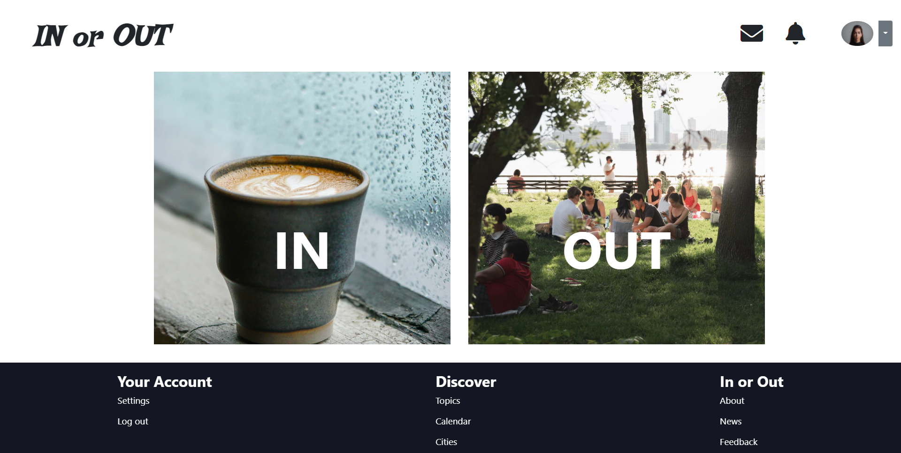
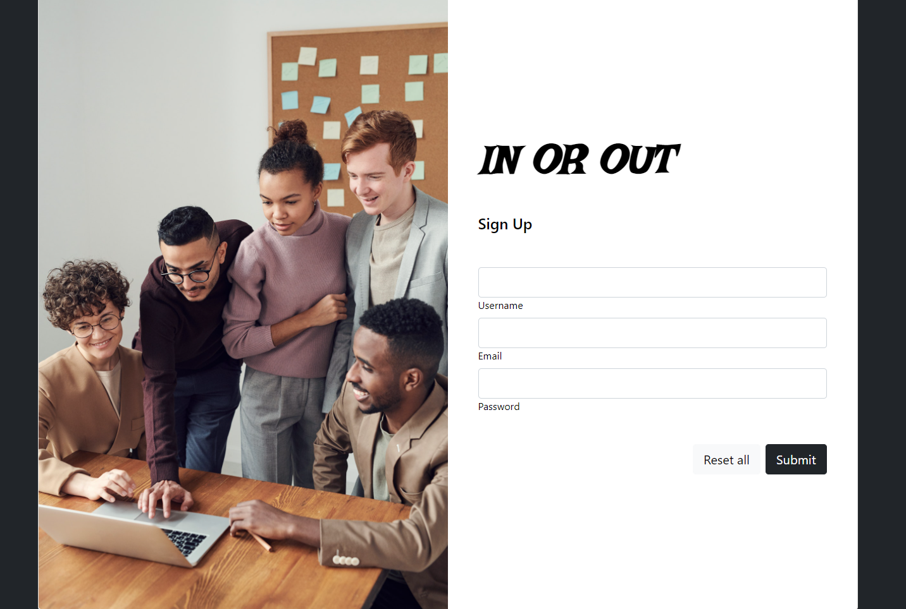
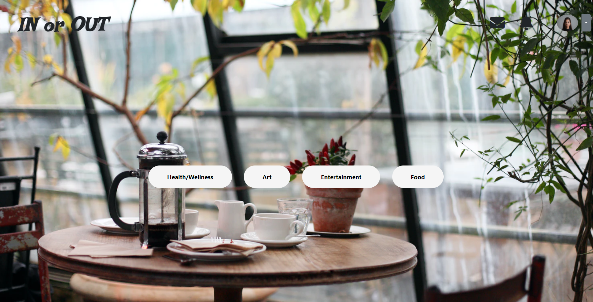
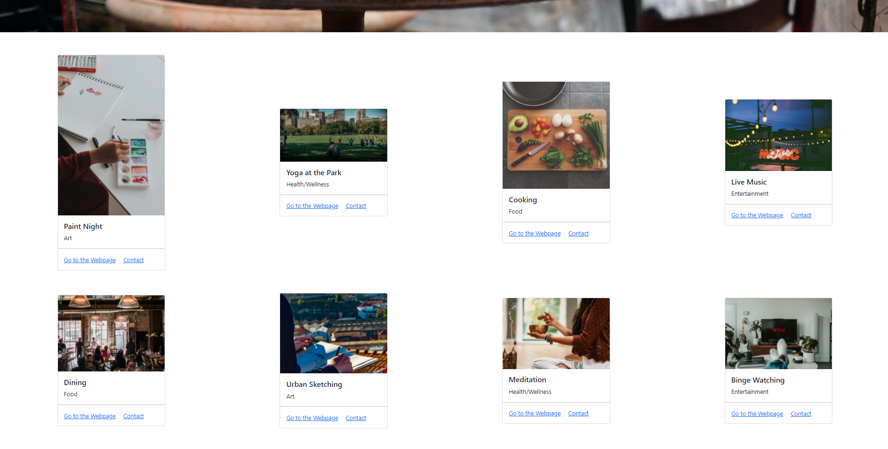
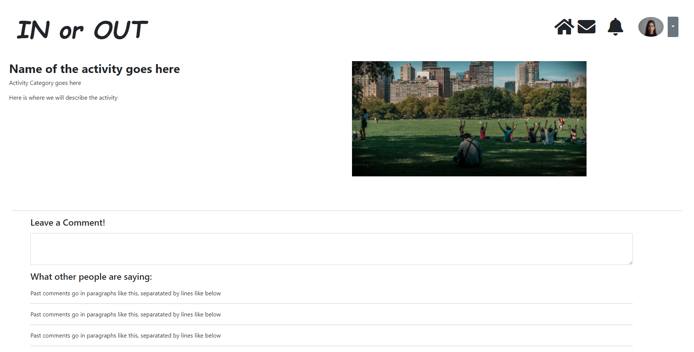

# <In-Or-Out>

## Description

This application has been built collaboratively within a context of a Pandemic. During the pandemic, many of us saw ourselves limited to indoor activities at our homes, which created the challenge of how to spend our time and entertain with less social activity. Also, at present, COVID-19 cases have decreased and restrictions are being lifted. This means businesses are reopening and social gatherings are becoming more common.

As demand for social activities increase, there is the opportunity to help people find or choose what they want to do and reconnect with their friends, families and passions.

1. This web application will allow users to first choose if they want to stay inside or if they want to go outside. 
2. Once chosen, the application will display a set of activity cards and present the user with preference buttons to filter activites.
3. Once filtered, the list of activities will be narrowed down. From this short list the user will be able to select an activity by cliking on the card.
4. Once an activity is selected, the user will be presented with more details about that specific activity.
5. If logged in, the user will be allowed to comment on the specific activity comments section and to see what other users have commented.

The USER STORY goes as follow

    AS A user
    I WANT an application that will generate possible ideas of activites
    SO THAT I can have options of things to do, spending more time doing and enjoying rather than choosing.  

## Table of Contents

  - [<In-Or-Out>](#in-or-out)
  - [Description](#description)
  - [Table of Contents](#table-of-contents)
  - [Installation](#installation)
  - [Usage](#usage)
  - [Credits](#credits)
  - [GitHub](#github)
  - [Features](#features)
  - [Tests](#tests)

## Installation

No installation is needed. This application is run in a live webpage.

## Usage

To use this application, go to the deployed webpage by followig this link: [Visit the deployed page]()

Once in the landing page, go to the upper right corner and click on the user button to either sign up or login.

After login, click on IN or OUT at the center of the page. This will take you to a set of either indoor or outdoor activities.

Once in the activites page, you can scroll down to see the full list of indoor or outdoor activites (depending on what you selected before) or you can click on the preferences buttons to filter the activities by category.

If you click on one of the preferences buttons, the list of activities will be narrowed down by your preference.

If you want to know more about a specific activity and join the conversation, click on one of the activity cards and it will take you to a focused info page, where you will be able to view more details and, if logged in, view and write comments regarding that activity.

## Credits

Collaborators:
- [Gifty](https://github.com/giftilicious)
- [Cathy](https://github.com/cathytanya)
- [Shamsher](https://github.com/SSinghcode)
- [Andrés](https://github.com/aj-pena)

Third-party assets:
- [Bootstrap](https://getbootstrap.com/)
- [fontawesome](https://fontawesome.com/)
- [npm](https://www.npmjs.com/)
- [Jest](https://jestjs.io/)
- [MySQL](https://www.mysql.com/)
- [Heroku](https://www.heroku.com/nodejs) 

Reference material:
- [w3schools](https://www.w3schools.com/)
- [StackOverflow](https://stackoverflow.com/)
- [Mozilla Developer Network](https://developer.mozilla.org/en-US/)
- [CSS-TRICKS guide to flexbox](https://css-tricks.com/snippets/css/a-guide-to-flexbox/)

## GitHub

If you want to know more details, feel free to [visit the repo](https://github.com/cathytanya/inout.git)

## Features

- Heroku
- SQL / MySQL- 
- Object Oriented Programming
- Model View Controller framework
- Bootstrap grid, cards, forms and dropdowns
- Google Fonts and Fontawesome fonts and icons
- Node.js
- File System
- npm
- Jest
- HTML/Handlebars
- CSS and Flexbox
- JavaScript

## Tests

Route: 
'public/js/test.js'

Test files: 

- test.js

How to run them: 

Fork the repo to a local folder.
From the local folder, open the command-line.
From the command-line (in the root folder of the local folder), run 'npm run test'.
You must install the npm jest dependency to be able to run the test using the mentioned command. 